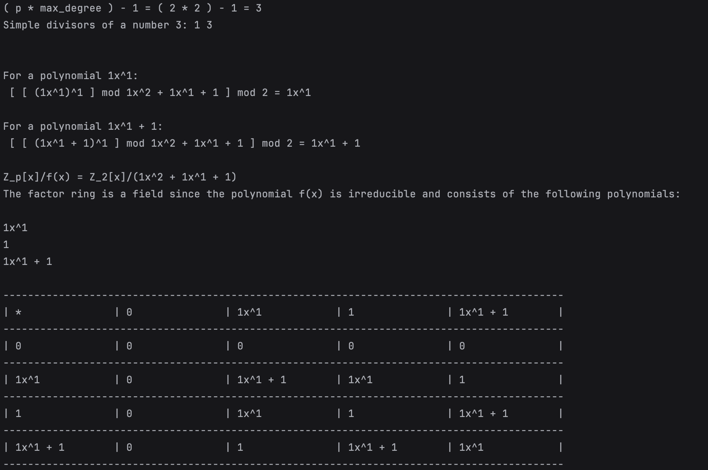

### Dependencies

- NTL
- GMP
- C++11
- I was using macOS, so launching the programme was as follows:

  g++ -std=c++11 -I/opt/homebrew/Cellar/ntl/11.5.1/include main.cpp create_factorgroup.cpp -o main -L/opt/homebrew/Cellar/ntl/11.5.1/lib -lntl -lgmp

# Pre-operation settings

This project allows you to build a factor ring and determine whether it is a field, as well as output the table of the factor ring

Before you start working, you need to configure a few parameters
in the main.cpp file

With these settings you can get this response from the programme:

